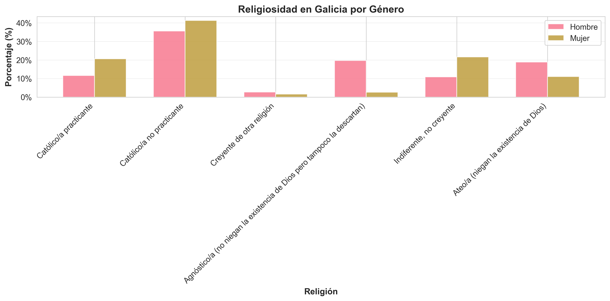
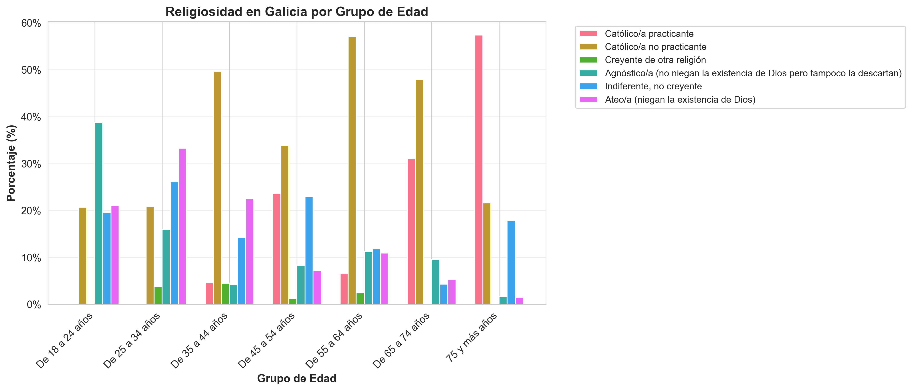
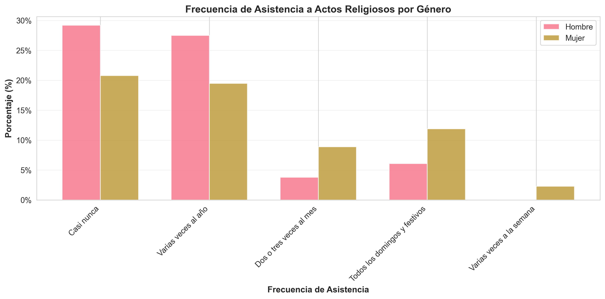
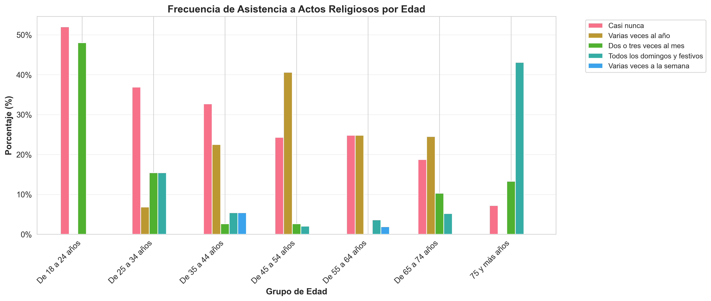

# 📊 Análisis de Religiosidad en Galicia

Proyecto de **análisis y visualización de datos** sobre religiosidad, frecuencia de asistencia a actos religiosos y distribución por género y edad en Galicia.

El objetivo del proyecto es **procesar datos sociológicos reales, limpiarlos, analizarlos y generar visualizaciones claras que permitan interpretar tendencias religiosas en la población gallega**.

---

# 📋 Descripción del Proyecto

Este proyecto analiza datos de un **barómetro de marzo de 2024** sobre religiosidad en Galicia.

**Fuente de datos:** Centro de Investigaciones Sociológicas (CIS)

El proyecto realiza:

* 📥 **Procesamiento de datos Excel**
* 🧹 **Limpieza y transformación de datos**
* 📊 **Visualización mediante gráficos**
* 🔍 **Análisis de tendencias por género y edad**

---

# 📁 Estructura del Proyecto

```
analisis_religioso_galicia/

├── README.md
├── requirements.txt
│
├── data/                         # Datos originales
│   ├── religiosidad_por_sexo.xlsx
│   ├── religiosidad_por_edad.xlsx
│   ├── frecuencia_atos_religiosos_por_sexo.xlsx
│   └── frecuencia_atos_religiosos_por_edad.xlsx
│
├── output/                       # Resultados generados
│   ├── *.csv
│   └── graficos/
│       ├── 01_religion_por_genero.png
│       ├── 02_religion_por_edad.png
│       ├── 03_frecuencia_por_genero.png
│       └── 04_frecuencia_por_edad.png
│
└── src/                          # Scripts Python
    ├── limpieza.py
    ├── scraping.py
    └── visualizacion.py
```

---

# 🧹 Procesamiento y Limpieza de Datos

Los archivos originales presentan varios problemas comunes en datasets sociológicos:

## Problemas identificados

* Archivos Excel con **múltiples encabezados**
* Columnas con nombres inconsistentes (`NaN`, `Unnamed`)
* Filas de metadatos mezcladas con datos reales
* Datos en **formato decimal poco intuitivo**

## Soluciones implementadas

✔ Creación de función reutilizable `limpiar_dataframe()`
✔ Eliminación automática de filas innecesarias
✔ Normalización de nombres de columnas
✔ Conversión de archivos Excel a **CSV estructurado**

Ejemplo de función utilizada:

```python
def limpiar_dataframe(ruta, header, fila_eliminar, renombrar_primera_col=True):
    """
    Limpia un archivo Excel eliminando filas sobrantes y
    estandarizando encabezados.
    """
```

Esto permite reutilizar la lógica de limpieza en múltiples datasets.

---

# � Visualización de Datos

Se generaron **4 gráficos de barras** para analizar las tendencias de religiosidad en Galicia.

Los gráficos se exportan en **alta resolución (300 DPI)** para uso en presentaciones o informes.

---

## Religión por Género



Comparativa de afiliación religiosa entre hombres y mujeres.

---

## Religión por Edad



Distribución religiosa según grupo de edad.

---

## Frecuencia de asistencia por género



Comparativa de asistencia a actos religiosos entre hombres y mujeres.

---

## Frecuencia de asistencia por edad



Análisis de frecuencia de asistencia según grupos generacionales.

---

# � Insights Principales

A partir del análisis de los datos se observan varias tendencias relevantes:

## Diferencias por género

* Las **mujeres presentan mayor nivel de religiosidad** que los hombres.
* Mayor porcentaje de **católicas practicantes**.
* Los hombres presentan **mayor proporción de ateísmo**.

---

## Diferencias generacionales

* Los **jóvenes (18-24 años)** presentan mayor proporción de:

  * agnosticismo
  * indiferencia religiosa

* Los **mayores de 65 años** muestran mayor proporción de:

  * católicos practicantes
  * asistencia regular a actos religiosos

Existe una **tendencia clara de aumento de religiosidad con la edad**.

---

## Frecuencia de asistencia

* Aproximadamente **un tercio de la población nunca asiste** a actos religiosos.
* Solo un **pequeño porcentaje asiste semanalmente**.
* La asistencia aumenta significativamente en los grupos de mayor edad.

---

# ⚙️ Tecnologías Utilizadas

* Python
* Pandas
* Matplotlib
* Seaborn
* OpenPyXL

---

# 🚀 Cómo Ejecutar el Proyecto

## 1️⃣ Clonar el repositorio

```bash
git clone https://github.com/Powfip/analisis_religioso_galicia.git
cd analisis_religioso_galicia
```

---

## 2️⃣ Crear entorno virtual

```bash
python -m venv .venv
source .venv/bin/activate
```

---

## 3️⃣ Instalar dependencias

```bash
pip install -r requirements.txt
```

---

## 4️⃣ Ejecutar el pipeline

Procesar datos:

```bash
python src/limpieza.py
```

Generar visualizaciones:

```bash
python src/visualizacion.py
```

---

# � Dependencias

```
pandas
matplotlib
seaborn
openpyxl
```

---

# � Posibles Mejoras Futuras

* Implementar **análisis estadístico avanzado**
* Crear **dashboard interactivo con Streamlit**
* Incorporar **tests automatizados**
* Generar **reportes automáticos en PDF**
* Integrar nuevos datasets sociológicos

---

# 👨‍💻 Autor

**Filipi Garcia**

Proyecto personal de **análisis de datos y visualización** desarrollado como parte de un portfolio de proyectos en Python y Data Analytics.

---

# 📜 Licencia

Proyecto de código abierto disponible para uso educativo y análisis.

---
